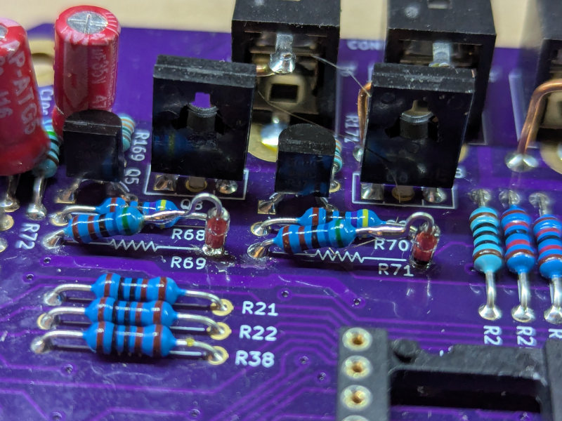

# TK2000 Build Notes

## Introduction
This document collects my notes on the building of a TK2000 clone from [here](https://github.com/clemarfolly/Microdigital-TK2000). Note that I am building a Rev. 1 board.
Thanks to [clemarfolly](https://github.com/clemarfolly) for all the work that made this possible!

The BOM provided with the project is incomplete, sometimes not matching original boards and the clone also needed a few mods to work properly.
Plus, I made some changes of my own to better match the Apple II+ schematics.

I also wired the board to use 4164, 5V-only powered DRAMs.

## BOM Changes

### Missing diodes in series with R69/R71

The original schematic has the emitter of Q5 and Q6 connected to GND, while original boards (and the clone) have the base connected to -12V.
Original boards also introduce a protection diode in series with R69 and R71, which is not indicated in the clone's BOM.

The direction indicated in the clone's schematic is also wrong, and the diode should be facing the other direction as the one presented.

The diodes I have used here are 1N4148, for a lack of better information on what is used on original boards.

### -5V regulation circuit

The TK2000 regulates the -5V using a zener diode. Both diode type and series resistor are left unspecified in the schematic. 

Given that -5V is used only for the negative bias of the LM741 op-amp and on the external bus (where I expect the board making use of it will also have similarly low load), I decided to fit the following:

- D12 - TZX5V1A
- R72 - 750 ohm

I expect to handle loads of slightly less of 10mA this way, and it has worked for now.

### Reset circuit

The BOM has a wrong value for resistor R26 in the reset circuit, and is also missing the value for C100 capacitor.

- C100 - 100uF
- R26 - 10K ohm

### Keyboard repeat Clock

The original schematic provide no value for the C58 capacitor that sets the frequency for the oscillator used in the repeat circuitry of the keyboard.

I used a 100uF cap, that produces roughly 4Hz.

**This change is yet to be tested against real world usage**.

### Internal speaker

The components for the internal speaker are not populated on original boards, and left without value in the schematic.

I am not totally satisfied with this solution, as the volume is still too low for my liking, but it works:

- Q7 - BC548
- R67 - 27 ohm
- R73 - 2K ohm
- R74 - 47K ohm
- C47 - 100nF

I also added another 47K resistor between the base of the transistor Q7 and +5V, this has improved the volume slightly.

### Connectors

I used the following connectors for the build:

- [PJ-301M](https://www.aliexpress.com/item/4000977771185.html) for the cassette/remote control ports
- [These](https://www.aliexpress.com/item/1005008453287975.html) coax connectors for the monitor/audio outputs. These are not a perfect fit and need to be dremeled (and have a tab snapped) to fit
- Right angle [DE9 female connectors](https://www.aliexpress.com/item/1005005458542870.html) for the power connection. It would be better to find a version of this with longer PCB mount pins
- [This](https://www.aliexpress.com/item/1005008354411366.html) 50 pin right angle edge socket
- [This](https://www.mouser.it/ProductDetail/571-5747467-4) DE9 male connector for the joystick port

### Other changes

- R17 - 1K ohm (the schematic has 2K, photos of original boards show 1K resistors)
- R9 - 680 ohm (original schematic had 1.2K, clone's had 12K, original boards have 680 ohm)
- J2 must be closed to provide 5V to DRAMs
- J13 is closed by default on original boards, needs jumpering here
- J12 is closed by default on original boards, needs jumpering here
- Close J4 for 4164, this must be jumpered to bring the muxed A7 line to pin 9 of the DRAMs. Also, remember to **REMOVE or NOT TO INSTALL C13 and C17** if you jumper this!

## Fixes

### Cassette input

The original schematic has an error around the feedback circuit of the OPAMP, and the clone inherits the same error (fixed on original boards):
R2 should be disconnected from the junction of pin 6 of U32 and the R3 resistor, and connected between R3 and pin 2 of U31.

Also, some component values are wrong or missing.

- R2 - 12K ohm
- C64 - 100nF

## Mods

### Apple II video amplifying circuit

I replaced part of the video circuit in the schematic (which doesn't have most of the values for components indicated) with the video circuit from the Apple II.

- Q3 - 2N3904 (remember to rotate the transistor to account for different pinout). This change is probably not needed.
- R23 - 10 ohm
- R46 - 20 ohm
- R47 - 180 ohm

Then I cut the trace going from the junction of R46 and R47 to the center of the coax connector, and replaced it with a 27 ohm resistor in series with a 2.7 uH inductor.

### Color burst circuit

The schematic does not specify what value to use for capacitor C51, and the value of L1 seems wrong in respect to original schematic and boards.

Install a 27uH inductor for L1: clone's schematic has 47uH, but Apple II and original boards show 27uH inductors here.

If one is content with a fixed cap, something around ~80pF for C51 is probably ok, otherwise, install a 47pF here and then a 5-50pF variable capacitor beside L1 (between the collector of Q1 and GND) by scratching some of the nearby solder mask.
This will give you a way to adjust the color burst.

### Clock generation circuit

I did not have BF494B transistors on hand, and the schematic also did not indicate values for the capacitors in the clock circuit, so I peformed the following replacements

- Q2 - 2N2222A (probably not necessary if you have the proper transistor), remember to account for the different pinout and twist the legs of the replacement properly
- C46 - 10pF, note that depending on the crystal You're using, you might have to tweak the value of this
- C49 - 100pF, same as above
- C50 - 10pF
- R40 - 47 ohm
- R41 - 1.5K ohm
- R42 - 22K ohm

I used [these](https://www.mouser.it/ProductDetail/815-ABL-14.31818B2) crystals for my NTSC modded board.

### Color smearing in B/W screens

I noticed that, even though the color bust is absent, in screens that should be B/W only, some of my TVs are generating a colored, smeared picture.

I found out that this can be fixed by adding a small capacitance of around 150pF (I used two caps in parallel, 100 + 47pF) between the base of Q3 and GND.

I placed the caps near R17, on the underside of the board.

### NTSC mod

This is not mine, and comes from a facebook group (lost the link...), but as I did this on my unit, I'll report it here.

- Replace whatever crystal in the unit with a 14.31818Mhz crystal.
- Remove U52 (74LS157) from the socket, lift pin 1 so it doesn't make contact when reinserted. Solder pin 1 and pin 8 (GND) together with a small wire on top of the IC.
- Remove U51 (74LS174) from the socket, lift pin 2 so it doesn't make contact when reinserted.
- Turn the board around, use a thin wire to solder pins 2, 3 and 4 on the underside of U51 together.

